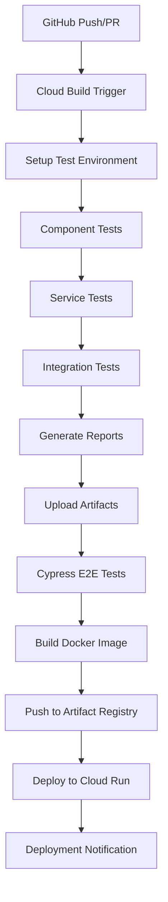

# Comprehensive Test Suite CI/CD Integration

## Overview

This document explains how the comprehensive test suite integrates with your Google Cloud Run deployment pipeline using Cloud Build.

## 🏗️ CI/CD Pipeline Architecture

### Current Pipeline Flow



## 📍 Where Tests Run in CI/CD

### 1. **Test Execution Environment**
- **Platform**: Google Cloud Build
- **Container**: Docker containers via `docker-compose.test.yml`
- **Trigger**: Automatic on push to `main` branch or manual trigger
- **Duration**: ~15-25 minutes for complete suite

### 2. **Test Stages in Pipeline**

#### Stage 1: Environment Setup (Step 1)
```yaml
- id: "Setup test environment"
  name: 'gcr.io/cloud-builders/docker'
  args: ['compose', '-f', 'docker-compose.test.yml', 'build', 'frontend-test']
```
- Builds test environment with all dependencies
- Installs npm packages and prepares test runner

#### Stage 2: Comprehensive Test Suite (Steps 2-5)
```yaml
# Step 2: Full test suite with coverage
- id: "Run comprehensive frontend tests"
  args: ['compose', '-f', 'docker-compose.test.yml', 'run', '--rm', 'frontend-test', 'npm', 'run', 'test:ci']

# Step 3: Component-specific tests
- id: "Run component tests"
  args: ['npm', 'run', 'test:components-only']

# Step 4: Service layer tests
- id: "Run service tests"
  args: ['npm', 'run', 'test:services-only']

# Step 5: Integration tests
- id: "Run integration tests"
  args: ['npm', 'run', 'test:integration-only']
```

**Tests Executed:**
- ✅ **Dashboard Component Tests** (25+ test cases)
- ✅ **DailyEntry Component Tests** (20+ test cases)
- ✅ **FinanceDashboard Component Tests** (20+ test cases)
- ✅ **Nutrition Service Tests** (API layer testing)
- ✅ **Integration Tests** (Cross-app functionality)

#### Stage 3: Report Generation (Step 6)
```yaml
- id: "Generate test reports"
  args: ['node', 'run_all_tests.js']
```
- Generates HTML and JSON reports
- Creates coverage reports
- Produces professional test documentation

#### Stage 4: Artifact Storage (Step 7)
```yaml
- id: "Upload test artifacts"
  # Uploads to gs://samaanai-build-artifacts/frontend-tests/build-{BUILD_ID}/
```
- Stores test reports in Cloud Storage
- Maintains build history with traceability
- Automatic lifecycle management (30-day retention)

#### Stage 5: E2E Testing (Step 8)
```yaml
- id: "Run E2E tests"
  args: ['compose', '-f', 'docker-compose.test.yml', 'run', '--rm', 'cypress']
```
- Full application testing with Cypress
- Real browser automation
- Screenshots and videos on failure

## 🎯 Test Coverage Areas

### Frontend Applications
1. **Nutrition App (Calorie Tracker)**
   - Dashboard functionality
   - Daily entry forms
   - Weight tracking
   - Chart rendering
   - User profile integration

2. **Finance App**
   - Financial dashboard
   - Account management
   - Transaction display
   - Financial calculations
   - Chart visualizations

3. **Cross-App Integration**
   - Navigation between apps
   - State management
   - Authentication flow
   - Responsive design

### Test Types
- **Unit Tests**: Individual component testing
- **Integration Tests**: Cross-component functionality
- **Service Tests**: API layer and data handling
- **E2E Tests**: Complete user workflows
- **Visual Tests**: Chart rendering and UI components

## 🚀 Setup Instructions

### Prerequisites
- Google Cloud Project with billing enabled
- GitHub repository connected to Cloud Build
- Docker and docker-compose installed locally (for testing)

### 1. Quick Setup
```bash
# Clone the repository and run the setup script
git clone your-repo
cd your-repo
./setup-ci-cd.sh
```

### 2. Manual Setup

#### Step 1: Create Cloud Storage Bucket
```bash
gsutil mb -l us-west1 gs://samaanai-build-artifacts
gsutil lifecycle set lifecycle.json gs://samaanai-build-artifacts
```

#### Step 2: Enable APIs
```bash
gcloud services enable cloudbuild.googleapis.com
gcloud services enable run.googleapis.com
gcloud services enable artifactregistry.googleapis.com
```

#### Step 3: Configure IAM
```bash
PROJECT_NUMBER=$(gcloud projects describe $PROJECT_ID --format="value(projectNumber)")
BUILD_SA="${PROJECT_NUMBER}@cloudbuild.gserviceaccount.com"

gcloud projects add-iam-policy-binding $PROJECT_ID \
    --member="serviceAccount:$BUILD_SA" \
    --role="roles/storage.admin"
```

#### Step 4: Create Build Triggers
```bash
gcloud builds triggers create github \
    --repo-name=your-repo-name \
    --repo-owner=your-github-username \
    --branch-pattern="^main$" \
    --build-config=cloudbuild-frontend.yaml \
    --name=samaanai-frontend-comprehensive-tests
```

## 📊 Test Reports and Artifacts

### Report Locations
- **Test Reports**: `gs://samaanai-build-artifacts/frontend-tests/build-{BUILD_ID}/`
- **Coverage Reports**: Included in test reports with HTML visualization
- **Cypress Videos**: `gs://samaanai-build-artifacts/cypress/build-{BUILD_ID}/videos/`
- **Screenshots**: `gs://samaanai-build-artifacts/cypress/build-{BUILD_ID}/screenshots/`

### Report Contents
1. **HTML Dashboard**: Professional test results with charts
2. **JSON Reports**: Machine-readable test data
3. **Coverage Reports**: Line-by-line code coverage
4. **Performance Metrics**: Test execution times
5. **Failure Screenshots**: Visual debugging for E2E tests

## 🔧 Configuration Files

### Key Files
- `cloudbuild-frontend.yaml`: Main CI/CD pipeline configuration
- `docker-compose.test.yml`: Test environment setup
- `frontend/run_all_tests.js`: Comprehensive test runner
- `frontend/package.json`: Test scripts and dependencies
- `lifecycle.json`: Cloud Storage lifecycle management

### Environment Variables
```yaml
CI=true                    # Enables CI mode for tests
NODE_ENV=test             # Test environment configuration
GENERATE_SOURCEMAP=false  # Faster builds
REACT_APP_API_URL=...     # Backend API endpoint
```

## 🎮 Running Tests

### Local Development
```bash
# Run all tests locally
cd frontend
npm run test:all

# Run specific test categories
npm run test:components-only
npm run test:services-only
npm run test:integration-only

# Run with coverage
npm run test:coverage
```

### CI/CD Triggers
1. **Automatic**: Push to `main` branch
2. **Manual**: Cloud Build console trigger
3. **PR Testing**: Pull request validation

## 📈 Monitoring and Debugging

### Build Monitoring
- **Cloud Build Console**: https://console.cloud.google.com/cloud-build/builds
- **Real-time Logs**: Stream build logs during execution
- **Build History**: Track success/failure rates over time

### Debugging Failed Tests
1. **Check Build Logs**: Detailed error messages in Cloud Build
2. **Download Artifacts**: Test reports and screenshots
3. **Local Reproduction**: Run same tests locally
4. **Cypress Debug**: Video recordings of E2E test failures

### Common Issues and Solutions

#### Test Timeouts
```yaml
# Increase timeout in cloudbuild-frontend.yaml
timeout: '2400s' # 40 minutes
```

#### Memory Issues
```yaml
# Use larger machine type
machineType: 'E2_HIGHCPU_8'
```

#### Flaky Tests
- Check test isolation
- Review async/await patterns
- Verify mock configurations

## 🔄 Continuous Improvement

### Metrics to Track
- Test execution time
- Test coverage percentage
- Build success rate
- Deployment frequency

### Regular Maintenance
- Update dependencies monthly
- Review and update test cases
- Clean up old artifacts
- Monitor build performance

## 🚨 Troubleshooting

### Build Failures
1. Check Cloud Build logs for specific errors
2. Verify Docker compose configuration
3. Ensure all environment variables are set
4. Check IAM permissions

### Test Failures
1. Review test reports in Cloud Storage
2. Check for environment-specific issues
3. Verify mock data and API responses
4. Run tests locally to reproduce

### Deployment Issues
1. Verify Cloud Run service configuration
2. Check environment variables
3. Ensure proper image tagging
4. Review IAM permissions for deployment

## 📞 Support

For issues with the test suite:
1. Check the build logs in Cloud Build console
2. Review test artifacts in Cloud Storage
3. Run tests locally for debugging
4. Check GitHub Actions/Issues for known problems

---

**Next Steps:**
1. Run `./setup-ci-cd.sh` to configure your environment
2. Push changes to trigger first comprehensive test run
3. Monitor results in Cloud Build console
4. Review test reports in Cloud Storage 