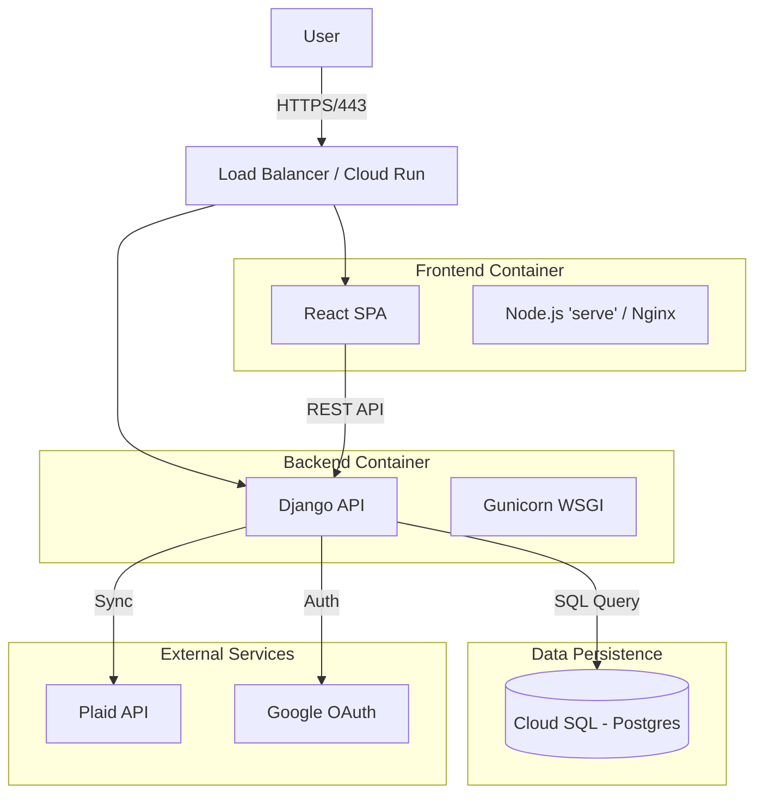

# Project Overview & Architecture

## 1. Executive Summary
**Samaanai** is a full-stack personal finance and nutrition tracking application. It aggregates financial data via Plaid and nutrition data via local logging, providing a unified dashboard for personal health and wealth tracking.

## 2. Technology Stack

### Frontend (Client-Side)
- **Framework**: React 18
- **Language**: JavaScript/TypeScript (mixed based on file extensions, predominantly JS in structure but configured for potential TS usage)
- **Build Tool**: Create React App (Scripts)
- **Styling**: Uses CSS/SCSS with potentially Material UI or custom components.
- **State Management**: React Context / Hooks
- **Routing**: React Router
- **HTTP Client**: Axios (inferred)
- **Testing**: Jest, Cypress (E2E)

### Backend (Server-Side)
- **Framework**: Django 4.x / Django Rest Framework (DRF)
- **Language**: Python 3.10
- **Database**: PostgreSQL 14
- **ORM**: Django ORM
- **Authentication**: JWT (JSON Web Tokens) with Google OAuth 2.0 integration
- **Integrations**: 
    - **Plaid**: for banking transactions/auth
    - **Google**: for user authentication

### Infrastructure & DevOps
- **Containerization**: Docker & Docker Compose
- **CI/CD**: Google Cloud Build
- **Production Runtime**: Google Cloud Run (Serverless Containers)
- **Database**: Google Cloud SQL (PostgreSQL)
- **Reverse Proxy**: Nginx (used in certain docker configs)

## 3. High-Level Architecture

## 4. Key Flows
1.  **Authentication**: Users sign in via Google OAuth. The frontend receives an ID token, exchanges it with the Django backend for a session/JWT.
2.  **Data Synchronization**:
    -   **Finance**: Backend periodic tasks (or on-demand) fetch transaction data from Plaid using stored access tokens (encrypted).
    -   **Nutrition**: User inputs data manually, stored directly in Postgres.

## 5. Deployment Architecture (Google Cloud)
The system is designed to be stateless and containerized, making it ideal for **Cloud Run**.
-   **Backend Service**: Scalable container instance running Gunicorn. Connects to Cloud SQL via private VPC connector or Cloud SQL Proxy.
-   **Frontend Service**: Scalable container serving static assets.
-   **Secrets**: Managed via Google Secret Manager, injected as environment variables at runtime.
